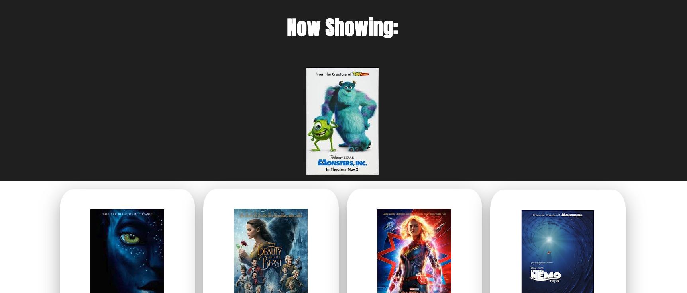
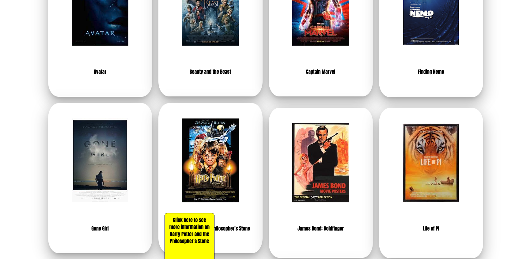
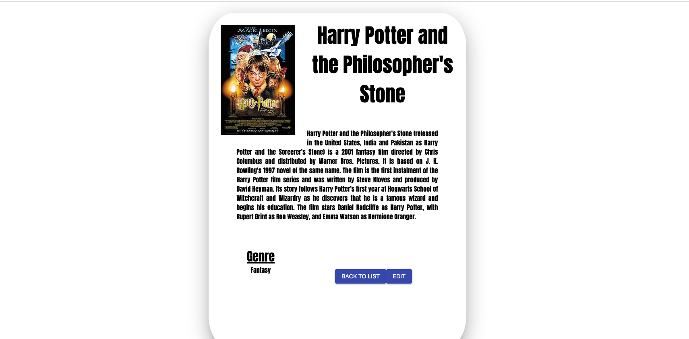
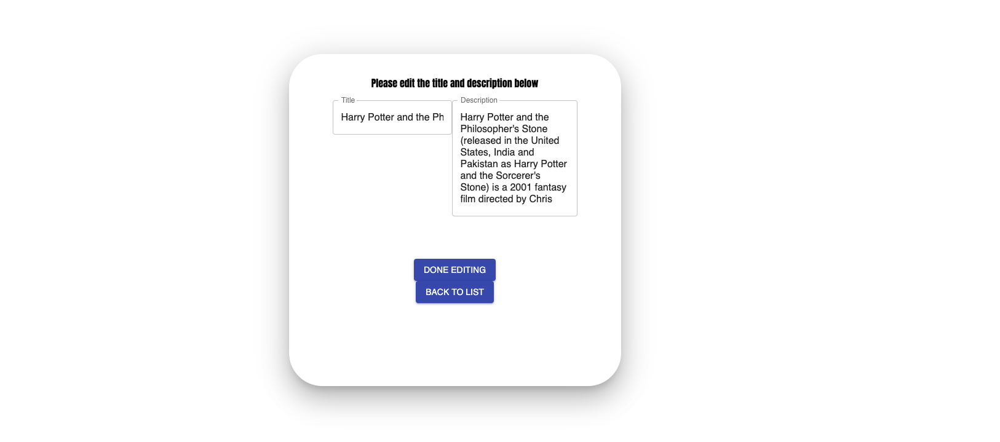

# Movie Gallery

A gallery of movies stored in a database. The header will scroll through a random generated movie poster from the database and scroll it in from the right, it will hang in the middle for a few seconds, and then exit via the left. It will then be replaced with another random generated poster and repeat the process. Below that a list of all of the movies will be listed. If you hover over a picture you will see a notice that says to click here for more info on that movie. If you click on that spot you will be brought to the details page where you can see more details about the movie, click the edit button to edit this information.

## Languages used

This app was built using the following coding languages and libraries 

-HTML
-CSS
-JavaScript
-React.js
-Node.JS
-Redux
-Material UI
-Sweet Alerts
-PG
-SQL
-Google Fonts
-Axios

#### Instructions

1. The header will scroll through random movie photos at the top at a 20 second introval. It will slide in from right, at the 15% animation mark it will rest in the center, it will then resume at the 85% animation mark and slide off to the right. The animation repeated infinitely and a new photo getas generated every 20 seconds

2. if you scroll further down you will see a list of all the movies, if you hover your curser over any movie, you will informed that you can click that spot for more information on that paticular movie.

3. Here you will be greeted with a page that scrolls in from the right at a 1 second animation and rests in the center. On the page you will see more information about that movie including the title, photo, description and a list of all the genres. You can also either click the "back to list" button to go back a page, or click "edit" to edit the title and description of this current movie.

4. If you click edit you will be brought to an edit page with input fields that are populated with the current information for that movie. You can then change any details about that movie. When you are done click "Done Editing" to submit your changes. Click "go back" to go back to the home page

5. When you click "done editing" you will be prompted with a notice informing you that the changes are permanent and can't be undone. If you click "ok" your changes will be saved and you'll be brought back to the home page. If you click cancel you will be informed that your changes were canceled and you will be brought back to the homepage.

6. 4 through 5 will generate the response on the left, 1 through 3 will generate the response on the right. Here you can give feedback. Type your feedback in and click "submit feedback". This is not a required field.

7. Once you click "submit feedback" a final "click to confirm" button will scroll up from the bottom and rest under the "submit feedback" button. Click "Click to Confirm" to submit your information.

8. A pop up will appear. This is the summary page. You can review all of your submitted information and either click "ok" to confirm or "cancel" to cancel. Upon clicking okay you submit your information and be brought back to the start page again. Clicking cancel will also bring you back to the start page, but your information won't be saved.

9. Finally there a secret admin page that can be accessed with the route "/admin". Type that into the address bar above and you'll see a table with all of the submitted survey information. Here you can see ther date the survey was submitted. You can flag any surveys for review. Flagging a survey for review will cause the flag icon to turn from white to black. This information is also sent to the database as a boolean value. You can also delete any surveys with the delete button.

